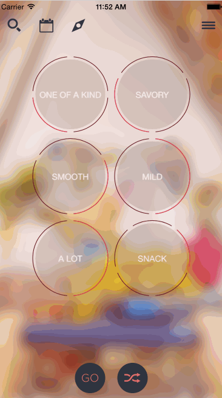

# iOSChallenge-Swift

This is an iOS Swift demo application for an iOS challange

Completed Features:

 * [x] Required: A Navigation bar that contains four buttons.
 * [x] Required: A set of six custom UIControls (or one Custom UIControl subclass instantiated six times) that when pressed cycle between a limited number of choices.
 * [x] Required: A randomize button that will set the UIControls to a random set of choices.
 * [x] Required: A go button that will move to the next View Controller.
 * [x] Optional: Animations (and sound)for when the for randomize button is pressed.
 * [x] Optional: Custom animation in or out of this VC.
 * [x] Optional: The Custom UIControl you create is accessible via storyboard.

Walkthrough of features:

GIF created with [LiceCap](http://www.cockos.com/licecap/).
